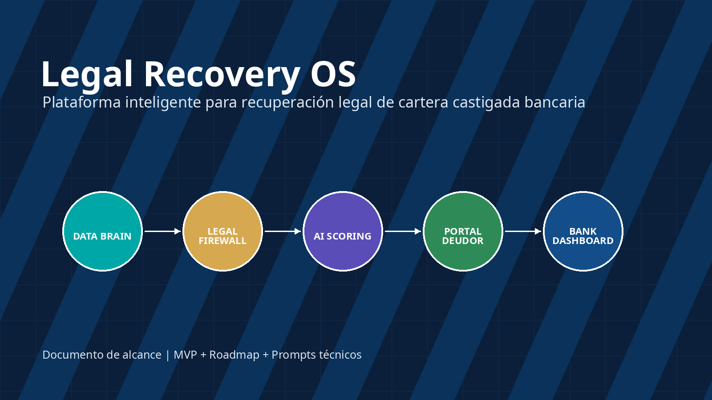
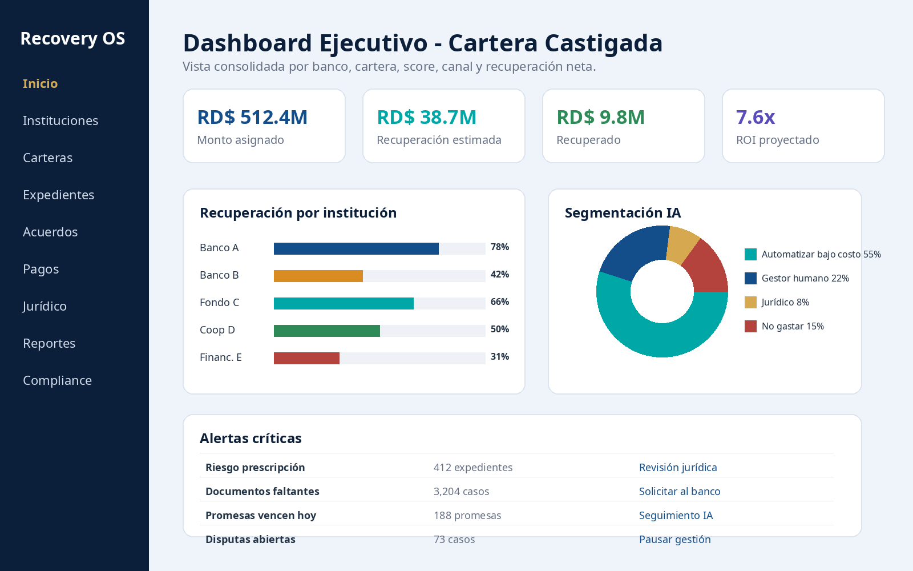
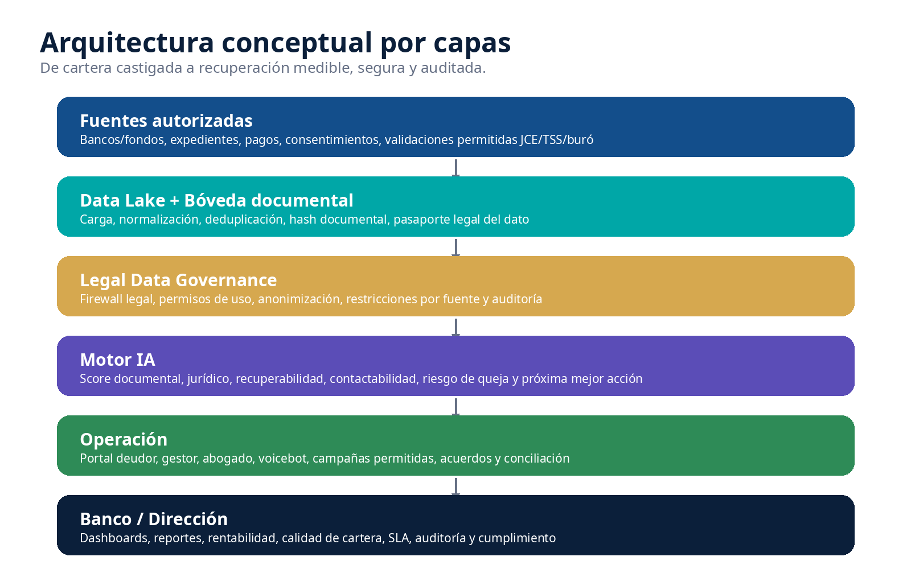
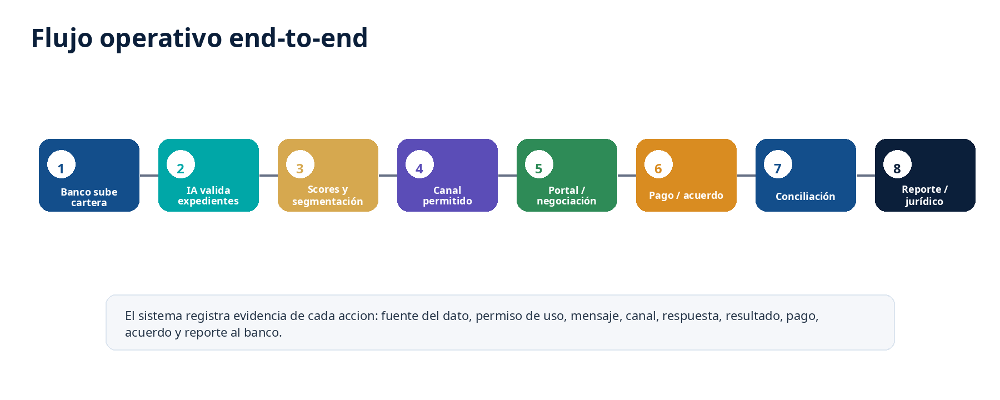
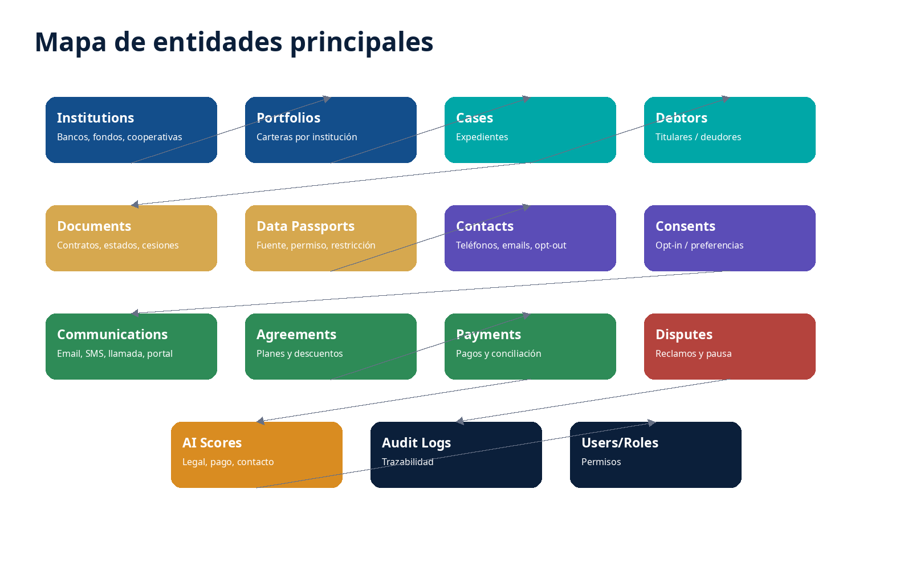
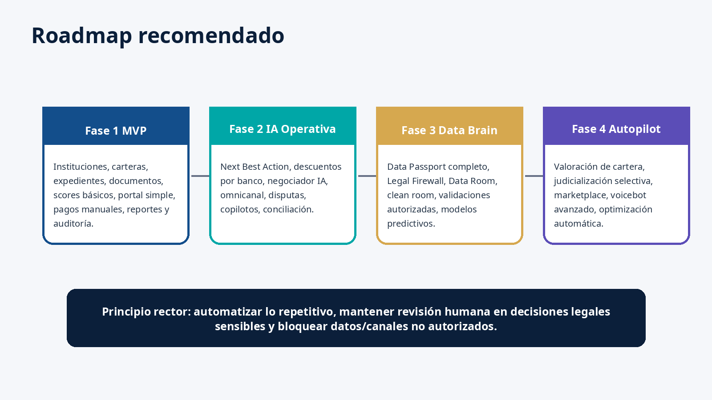
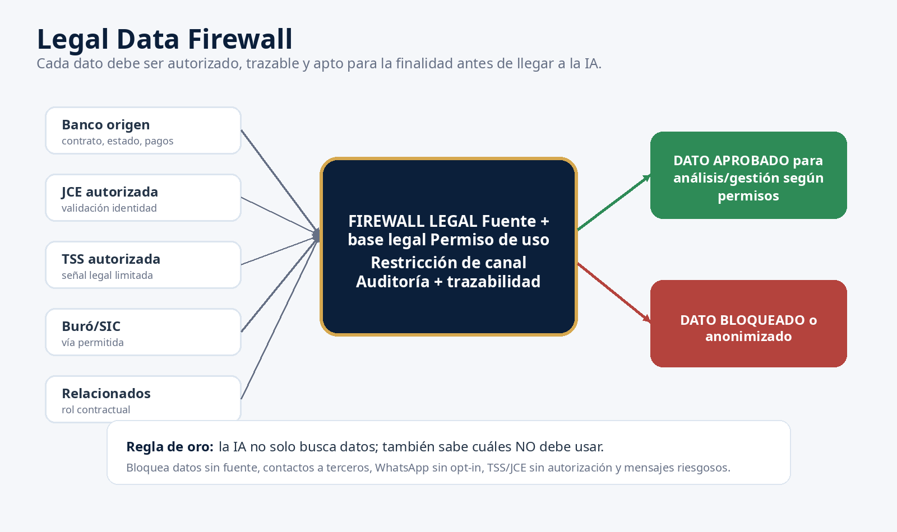

# Legal Recovery OS - Documento de Alcance

---

## Página 1

Legal Recovery OS - Documento de Alcance
Documento preliminar para diseño y desarrollo. Requiere validación legal antes de producción.
DOCUMENTO DE ALCANCE FUNCIONAL Y TECNICO
Legal Recovery OS + Legal Recovery Data 
Brain 360
Plataforma inteligente para recuperación legal de cartera castigada bancaria
MVP, arquitectura, módulos, gobierno de datos, IA, cumplimiento, roadmap y prompts de desarrollo

**Imágenes en esta página:**

---

## Página 2

Legal Recovery OS - Documento de Alcance
Documento preliminar para diseño y desarrollo. Requiere validación legal antes de producción.
Tabla de contenido
1. Resumen ejecutivo
2. Objetivo del producto
3. Alcance general
4. Principios rectores
5. Arquitectura conceptual
6. Roles y usuarios
7. Modulos funcionales
8. Bank Portfolio Intelligence
9. Legal Data Governance y Data Passport
10. Fuentes externas autorizadas
11. Inteligencia artificial y scoring
12. Portal de deudor y negociacion
13. Comunicaciones omnicanal
14. Pagos, conciliacion y paz y salvo
15. Copilotos, voicebot y operacion legal
16. Dashboards y reportes
17. Seguridad, auditoria y cumplimiento
18. Modelo de datos inicial
19. MVP y fases
20. Riesgos y controles
21. Criterios de aceptacion
22. Referencias

**Imágenes en esta página:**

---

## Página 3

Legal Recovery OS - Documento de Alcance
Documento preliminar para diseño y desarrollo. Requiere validación legal antes de producción.
1. Resumen ejecutivo
Legal Recovery OS es una plataforma para oficinas legales que gestionan carteras castigadas de bancos, fondos, 
financieras, cooperativas y otras entidades cedentes. El sistema no se limita a enviar mensajes de cobro: 
diagnostica la cartera, valida expedientes, gobierna datos, calcula recuperabilidad, selecciona el canal correcto, 
habilita acuerdos digitales, concilia pagos y reporta resultados al banco con trazabilidad completa.
Idea central
La plataforma convierte una oficina de gestion legal tradicional en una operacion de recuperacion inteligente: menos 
SMS, menos llamadas inutiles, mayor recuperacion neta, menos riesgo legal y mejor control para bancos y fondos.
2. Objetivo del producto
Diseñar y desarrollar una plataforma modular, segura y auditable que permita gestionar carteras castigadas 
bancarias desde la recepcion hasta la recuperacion, conciliacion, reporte y eventual escalamiento juridico.

Centralizar instituciones financieras, carteras, expedientes, documentos, pagos, acuerdos y comunicaciones.

Aplicar IA para priorizar casos recuperables y reducir gasto operativo por contacto.

Controlar el uso de datos mediante pasaporte legal, permisos, restricciones y auditoria.

Ofrecer al deudor un portal seguro para validar identidad, revisar su caso, negociar, pagar o abrir disputa.

Proveer a bancos y fondos dashboards, reportes y trazabilidad de la gestion.

Escalar a abogados solo los expedientes con fortaleza documental, monto y recuperabilidad suficientes.
3. Alcance general

**Imágenes en esta página:**

---

## Página 4

Legal Recovery OS - Documento de Alcance
Documento preliminar para diseño y desarrollo. Requiere validación legal antes de producción.
Figura 1. Arquitectura conceptual por capas.
El alcance se divide en tres niveles: administracion de cartera, inteligencia de recuperacion y gobierno legal de 
datos. El desarrollo debe iniciar por un MVP vendible y ampliarse progresivamente hasta un Data Brain completo.
Nivel
Incluye
Resultado esperado
Prioridad
Operativo
Instituciones, carteras, 
expedientes, documentos, 
acuerdos, pagos, reportes
Control completo de la gestion 
diaria
MVP
IA
Scores, segmentacion, proxima 
mejor accion, ofertas, copilotos
Mas recuperacion con menos 
gasto
Fase 2
Datos
Data Passport, Legal Firewall, 
trazabilidad, fuentes autorizadas
Uso de datos defensible y 
auditable
MVP/Fase 2
Estrategico
Valorizacion de carteras, 
simulador, judicializacion 
selectiva
Mejor negociacion con bancos y 
fondos
Fase 3
4. Principios rectores

No usar datos sin fuente, permiso y finalidad documentada.

No contactar terceros no autorizados ni revelar deudas por canales inseguros.

No convertir WhatsApp en canal masivo de cobro; usarlo solo bajo reglas, consentimiento y mensajes neutrales 
cuando aplique.

No gastar igual en todos los expedientes: cada caso debe tener presupuesto, score y proxima accion.

La IA recomienda y automatiza tareas repetitivas; las decisiones legales sensibles quedan bajo humano 
responsable.

Toda accion debe dejar evidencia: quien, cuando, canal, mensaje, fuente de dato, resultado y proxima accion.
5. Roles y usuarios
Rol
Permisos principales
Restricciones
Indicadores clave
Super Admin
Configura plataforma, clientes, 
seguridad, integraciones
No debe operar expedientes sin 
trazabilidad
Disponibilidad, usuarios, auditoria
Administrador oficina legal
Gestiona carteras, reglas, equipos, 
reportes
No modifica auditoria ni evidencia
Recuperacion neta, SLA
Supervisor
Asigna casos, revisa campanas y 
calidad
No aprueba descuentos fuera de 
politica
Conversion, calidad, quejas
Gestor
Trabaja casos asignados y registra 
gestiones
No ve datos restringidos; no contacta 
terceros
Promesas, acuerdos, pagos
Abogado
Evalua expedientes, prepara 
acciones juridicas
No usa datos sin base legal
Casos listos, demandas, acuerdos
Compliance / Auditor
Revisa cumplimiento, bloquea 
riesgos
No altera datos operativos
Riesgos, opt-out, disputas
Banco / Fondo
Consulta su cartera, reportes y 
documentos
Solo ve su institucion
Recuperacion, disputas, calidad
Deudor / Cliente
Portal seguro, acuerdos, pagos, 
disputas
Solo ve su expediente validado
Pagos, acuerdos, consultas

**Imágenes en esta página:**

---

## Página 5

Legal Recovery OS - Documento de Alcance
Documento preliminar para diseño y desarrollo. Requiere validación legal antes de producción.
6. Mapa general de modulos
Modulo
Descripcion
Fase sugerida
Administracion
Usuarios, roles, permisos, parametros, 
auditoria
MVP
Bank Portfolio Intelligence
Instituciones financieras, reglas, carteras, 
rentabilidad y reportes por banco
MVP
Expediente Legal
Deudores, productos, saldos, documentos, 
historial y estado legal
MVP
Legal Data Governance
Data Passport, Legal Firewall, 
consentimiento, fuente, permiso y restriccion
MVP
AI Recovery Brain
Scoring documental, legal, recuperabilidad, 
contactabilidad, riesgo y proxima accion
Fase 2
Portal Deudor
Validacion, consulta, acuerdo, pago, 
comprobante, disputa y preferencias
Fase 2
Comunicaciones
Email, SMS selectivo, llamadas, voicebot, 
cartas, WhatsApp neutral bajo reglas
Fase 2
Pagos y Conciliacion
Pagos, referencias, comprobantes, 
conciliacion, recibos y paz y salvo
MVP
Operacion Legal
Copiloto gestor, copiloto abogado, disputas, 
judicializacion selectiva
Fase 2
Dashboards
Banco, oficina, cartera, agente, 
cumplimiento, rentabilidad y SLA
MVP
7. Bank Portfolio Intelligence
Modulo estrategico para registrar las instituciones financieras origen, carteras recibidas, reglas por banco, politicas 
de descuento, documentos requeridos, comisiones y rentabilidad por institucion.

CRUD de bancos, fondos, cooperativas, financieras y entidades cedentes.

Clasificacion de cartera: asignada, cedida, comprada, mandato de gestion o judicializada.

Reglas por institucion: descuento, cuotas, aprobaciones, canales, documentos, SLA y judicializacion.

Dashboard por institucion: monto asignado, recuperado, recuperacion neta, expedientes completos, disputas y 
comisiones.

Ranking de calidad: documentacion, contactabilidad, recuperabilidad, friccion institucional y rentabilidad real.
Institucion
Tipo cartera
Regla descuento
Judicializacion
Reporte
Banco A
Tarjeta castigada
Hasta 30% automatico; 
45% con aprobacion
Desde RD$100,000 y 
expediente verde
Semanal
Banco B
Prestamo personal
Inicial minima 25%; hasta 6 
cuotas
Revision legal previa
Diario
Fondo C
Cartera comprada
Pago unico hasta 60%
Selectiva por ROI
Dashboard
Cooperativa D
Prestamos socios
Acuerdo flexible; sin 
descuento automatico
Solo monto alto
Mensual

**Imágenes en esta página:**

---

## Página 6

Legal Recovery OS - Documento de Alcance
Documento preliminar para diseño y desarrollo. Requiere validación legal antes de producción.
8. Legal Data Governance y Data Passport
Figura 2. Legal Data Firewall para aprobar, restringir o bloquear datos.
Cada dato dentro del sistema debe registrar su origen, fecha, base de uso, restriccion, confiabilidad y nivel de 
auditoria. Esto permite que la IA use solo datos autorizados y bloquee fuentes no validas o riesgosas.
Campo Data Passport
Funcion
Dato
Valor especifico: telefono, email, documento, saldo, relacion, permiso 
o registro.
Fuente
Banco, documento, portal, cliente, pago, validacion autorizada u otra 
fuente aprobada.
Fecha de captura
Momento en que el dato entro al sistema.
Base legal o contractual
Mandato, cesion, contrato, consentimiento, orden, convenio o regla 
interna.
Permiso de uso
Analisis, contacto, validacion, reporte, entrenamiento anonimizado o 
solo lectura.
Restriccion
No WhatsApp, no contacto, no tercero, no mostrar al gestor, solo 
abogado, anonimizar.
Confiabilidad
Puntaje de calidad del dato segun fuente, antiguedad y validacion.
Ultima validacion
Fecha de verificacion o actualizacion.
Visibilidad por rol
Quien puede ver o utilizar el dato.
Estado
Aprobado, restringido, bloqueado, vencido o en revision.

**Imágenes en esta página:**

---

## Página 7

Legal Recovery OS - Documento de Alcance
Documento preliminar para diseño y desarrollo. Requiere validación legal antes de producción.
9. Fuentes externas autorizadas
El sistema puede contemplar fuentes como JCE, TSS, buros o relacionados, pero solo mediante autorizacion, 
convenio, consentimiento, orden, contrato o base legal valida. El diseno no debe incluir scraping, compra de datos 
sin fuente ni uso de informacion de terceros para presionar deudores.
Fuente
Uso permitido sugerido
Uso prohibido/riesgoso
Control obligatorio
Banco/fondo
Base principal: cartera, documentos, 
pagos, contratos
Usar datos sin mandato o fuera de 
finalidad
Contrato, SLA, auditoria
JCE autorizada
Validacion de identidad y homonimos
Usar padron electoral para perfilar o 
presionar
Convenio/API permitida
TSS autorizada
Senal limitada bajo base fuerte
Scraping, presionar empleador, 
divulgar deuda
Base legal, logs, restriccion
Buro/SIC
Validacion crediticia permitida y 
reclamaciones
Consulta sin finalidad o autorizacion
Politica y trazabilidad
Relacionados
Codeudor, fiador, aval o contacto 
autorizado
Familiares/terceros para presionar
Rol contractual verificado
10. Inteligencia artificial y scoring
La IA debe operar con modelos explicables, auditables y con limites. El objetivo es priorizar recuperacion neta, 
evitar gasto innecesario y reducir riesgos de cumplimiento.
Score
Pregunta que responde
Variables base
Salida
Documental
Esta completo el expediente?
Contrato, cesion, estado, pagos, 
pagare
Verde/amarillo/rojo
Juridico
Tiene fortaleza legal?
Ultimo pago, prescripcion, disputa, 
soporte
Revisar/gestionar/judicializar
Recuperabilidad
Vale la pena gestionar?
Monto, historial, contacto, 
producto, antiguedad
Prioridad y presupuesto
Contactabilidad
Que canal usar?
Telefono, email, opt-in, respuesta 
previa
Email/portal/llamada/SMS
Riesgo de queja
Puede generar problema?
Terceros, disputas, frecuencia, 
tono
Normal/supervisor/compliance
Next Best Action
Que hacer ahora?
Todos los scores + reglas banco
Accion recomendada

**Imágenes en esta página:**

---

## Página 8

Legal Recovery OS - Documento de Alcance
Documento preliminar para diseño y desarrollo. Requiere validación legal antes de producción.
11. Portal de deudor y negociacion
Figura 3. Flujo operativo end-to-end desde recepcion de cartera hasta reporte.

Validacion progresiva de identidad antes de mostrar informacion sensible.

Vista de expediente, acreedor/cedente, saldo, documentos disponibles y opciones permitidas.

Boton “Proponga su acuerdo” con aceptacion automatica si entra en reglas del banco.

Pagos en linea, carga de comprobantes, promesas de pago y recordatorios neutrales.

Flujo de disputa: pausar gestion, solicitar soporte, revisar documentos y responder formalmente.

Generacion de recibo, carta de saldo o paz y salvo cuando aplique.
12. Comunicaciones omnicanal
El motor de comunicaciones debe priorizar canales de menor costo y menor riesgo: portal, email, carta con QR, 
llamada/voicebot y SMS solo cuando el ROI lo justifique. WhatsApp debe tratarse como canal restringido y neutral 
bajo reglas estrictas.
Canal
Uso recomendado
Costo
Riesgo
Control
Email
Notificacion formal con 
enlace seguro
Bajo
Bajo/medio
Plantillas y tracking
Portal
Autoservicio, acuerdo, 
pago y disputa
Bajo
Bajo
Validacion identidad
Carta QR
Formalidad e inbound
Medio
Bajo
QR unico
Voicebot
Clasificar intencion y 
derivar
Medio
Medio
Escalamiento humano
SMS
Fallback selectivo
Alto
Medio
Presupuesto por caso
WhatsApp
Neutral/atencion permitida
Medio
Alto
Opt-in y policy check
13. Pagos, conciliacion y paz y salvo

Registro de pagos por tarjeta, transferencia, deposito, pasarela y comprobantes manuales.

**Imágenes en esta página:**

---

## Página 9

Legal Recovery OS - Documento de Alcance
Documento preliminar para diseño y desarrollo. Requiere validación legal antes de producción.

Lectura de comprobantes con IA para detectar monto, fecha, banco, referencia y posible duplicidad.

Conciliacion contra movimientos bancarios o archivo del banco.

Actualizacion automatica de balance y detencion de campanas si el caso fue pagado.

Generacion de recibo, carta de cierre, saldo o paz y salvo segun reglas de la institucion origen.
14. Copilotos, voicebot y operacion legal

Copiloto de gestor: resumen del caso, oferta sugerida, riesgo, guion permitido y proxima accion.

Copiloto juridico: matriz probatoria, cronologia, documentos faltantes, riesgo de prescripcion y borradores.

Voicebot: llamada neutral, captura de intencion, transcripcion, promesa, solicitud de portal y derivacion 
humana.

Quality AI: revision de llamadas, chats y mensajes para detectar lenguaje riesgoso o incumplimiento.

Colas inteligentes: promesas vencen hoy, alto monto, disputa, expediente incompleto, judicializable y no 
rentable.
15. Dashboards y reportes
Figura 4. Mockup de dashboard ejecutivo para oficina legal y banco.

Dashboard ejecutivo: monto asignado, recuperado, recuperacion neta, ROI, costo por peso recuperado.

Dashboard por institucion: calidad documental, contactabilidad, disputas, comisiones y ranking de cartera.

Dashboard de gestor: casos asignados, promesas, acuerdos, conversion, calidad y alertas.

Dashboard juridico: casos listos, documentos faltantes, riesgo de prescripcion y costo judicial esperado.

Dashboard compliance: mensajes bloqueados, opt-out, quejas, datos restringidos y auditorias.

**Imágenes en esta página:**

---

## Página 10

Legal Recovery OS - Documento de Alcance
Documento preliminar para diseño y desarrollo. Requiere validación legal antes de producción.
16. Seguridad, auditoria y cumplimiento

Autenticacion con MFA para usuarios internos y bancos.

Control de acceso por rol, institucion, cartera y sensibilidad del dato.

Cifrado en transito y reposo para documentos, datos personales y pagos.

Logs inmutables de acciones criticas: cargas, descargas, contactos, mensajes, cambios de reglas y 
aprobaciones.

Politicas de retencion, anonimizado, bloqueo y eliminacion segun base legal.

Modo auditor: ver por que se uso un dato, quien lo vio, que canal se uso y que resultado obtuvo.
17. Modelo de datos inicial
Figura 5. Entidades principales del modelo de datos.
Entidades minimas sugeridas para MVP y escalabilidad:
institutions, institution_contracts, portfolios, portfolio_rules, debtors, cases, case_products,
documents, document_hashes, contacts, consents, related_parties, communications, campaigns,
ai_scores, legal_reviews, agreements, promises, payments, reconciliations, disputes, court_actions,
users, roles, permissions, audit_logs, data_passports, data_restrictions, bank_reports.
18. Arquitectura tecnica recomendada
Capa
Tecnologia sugerida
Notas
Frontend
Next.js / React
Portal interno, banco y deudor
Backend
FastAPI o NestJS
APIs, reglas, seguridad, integraciones

**Imágenes en esta página:**

---

## Página 11

Legal Recovery OS - Documento de Alcance
Documento preliminar para diseño y desarrollo. Requiere validación legal antes de producción.
Base datos
PostgreSQL
Multiinstitucion, auditoria y reportes
Archivos
S3 compatible / MinIO
Boveda documental con hash
IA
RAG privado + modelos controlados
No exponer datos sensibles sin anonimizar
Colas
Redis + Celery/BullMQ
Campanas, scoring, reportes, OCR
Dashboards
Metabase/Superset o propio
BI por banco y oficina
Seguridad
JWT, MFA, RBAC/ABAC
Permisos por rol y dato
PDF/Docs
Templates + generador
Cartas, acuerdos, recibos, reportes
19. MVP y fases de desarrollo
Figura 6. Roadmap de implantacion por fases.
Fase
Objetivo
Entregables
Resultado
MVP
Sistema vendible y operable
Login, bancos, carteras, 
expedientes, documentos, scores 
basicos, portal simple, acuerdos, 
pagos manuales, reportes
Control operativo inicial
Fase 2
Automatizar recuperacion
Next Best Action, negociador, 
omnicanal, conciliacion, disputas, 
copilotos
Menos costo y mas conversion
Fase 3
Data Brain y gobierno avanzado
Data Passport completo, clean 
room, validaciones autorizadas, 
modelos predictivos
Sistema bancarizable y auditable

**Imágenes en esta página:**

---

## Página 12

Legal Recovery OS - Documento de Alcance
Documento preliminar para diseño y desarrollo. Requiere validación legal antes de producción.
Fase 4
Autopilot estrategico
Valoracion de carteras, 
judicializacion selectiva, 
marketplace, voicebot avanzado
Nuevo modelo de negocio
20. Backlog MVP sugerido
Epica
Historias principales
Prioridad
Administracion
Usuarios, roles, permisos, MFA, parametros 
generales
Alta
Instituciones
CRUD instituciones, contratos, reglas, 
comisiones, SLA
Alta
Carteras
Carga CSV/Excel, validacion, deduplicacion, 
resumen de cartera
Alta
Expedientes
Ficha de deudor, productos, saldos, 
documentos, historial
Alta
Data Passport
Fuente, permiso, restriccion y estado del dato
Alta
Scores basicos
Documental, recuperabilidad simple, 
contactabilidad, riesgo
Alta
Portal deudor
Validacion, resumen, propuesta, pago manual, 
disputa
Alta
Acuerdos
Generacion, aprobacion por regla, seguimiento 
y promesas
Alta
Pagos
Registro y conciliacion manual inicial
Media
Reportes
PDF/Excel por banco, cartera, recuperacion, 
disputas
Media
Auditoria
Log de acciones, descargas, cambios, 
contactos y aprobaciones
Media
21. Riesgos y controles
Riesgo
Impacto
Control de sistema
Responsable
Datos sin autorizacion
Alto legal/reputacional
Legal Firewall y Data Passport 
obligatorio
Compliance
Contacto a terceros
Alto
Clasificacion de relacionados y 
bloqueo de canales
Gestor/Supervisor
WhatsApp para cobro directo
Alto
Canal restringido, opt-in, mensajes 
neutrales y policy check
Admin/Compliance
TSS/JCE sin convenio
Critico
Bloquear integraciones no 
autorizadas
Direccion legal
Expediente incompleto
Medio/alto
Score documental y solicitud al banco
Analista
Cobro de caso en disputa
Alto
Pausa automatica y flujo de disputa
Compliance
Pago no conciliado
Medio
Detener campana al detectar pago
Operaciones
IA inventa condicion legal
Alto
RAG controlado, plantillas y revision 
Abogado

**Imágenes en esta página:**

---

## Página 13

Legal Recovery OS - Documento de Alcance
Documento preliminar para diseño y desarrollo. Requiere validación legal antes de producción.
humana
22. Criterios de aceptacion del MVP
1.
El sistema permite crear instituciones financieras con reglas propias de cartera, descuentos, comisiones, SLA y 
documentos requeridos.
2.
El sistema permite cargar cartera desde Excel/CSV, validar estructura y crear expedientes con trazabilidad de 
fuente.
3.
Cada dato sensible debe tener Data Passport o quedar marcado como dato pendiente de clasificacion.
4.
El sistema calcula scores basicos de documentacion, contactabilidad y recuperabilidad.
5.
El portal de deudor permite validar identidad, consultar informacion minima, proponer acuerdo, cargar 
comprobante o abrir disputa.
6.
El sistema genera reportes por banco en PDF/Excel y dashboard web.
7.
Todas las acciones criticas quedan en audit_logs con usuario, fecha, IP, accion y objeto afectado.
8.
El sistema bloquea acciones prohibidas: contacto a terceros, caso en disputa, WhatsApp sin opt-in o dato sin 
permiso de uso.
9.
El banco solo puede ver su propia cartera y no datos de otras instituciones.
10. Los documentos cargados quedan almacenados con hash, usuario, fecha y relacion al expediente.
23. Posicionamiento comercial
Propuesta de valor
No somos una oficina de cobros tradicional. Somos una plataforma legal inteligente que diagnostica, valoriza, prioriza, 
regulariza, concilia y judicializa carteras castigadas con IA, trazabilidad y cumplimiento.

Para bancos: mas transparencia, menos quejas, mejor recuperacion neta y reportes en tiempo real.

Para la oficina legal: menos gasto operativo, mejor priorizacion, mayor productividad de gestores y abogados.

Para deudores: portal seguro, opciones de regularizacion, validacion de informacion, canal de disputa y paz y 
salvo.

Para inversionistas/fondos: valoracion de cartera, simulacion de recuperacion y control de riesgo documental.
24. Referencias y notas de cumplimiento
Estas referencias se incluyen como base inicial de cumplimiento y deben ser validadas por asesoria legal antes de 
pasar a produccion:

Ley No. 172-13 sobre proteccion de datos personales - Superintendencia de Bancos: https://www.sb.gob.do/regulacion/leyes/ley-no-172-
13-proteccion-de-los-datos/

Texto Ley No. 172-13 - ONE: https://www.one.gob.do/media/u5ohmfyp/ley-172-13.pdf

WhatsApp Business Messaging Policy: https://whatsappbusiness.com/policy/

WhatsApp Business Platform Policy Violations - Meta Developers: 
https://developers.facebook.com/documentation/business-messaging/whatsapp/policy-enforcement-violations/

Politicas de privacidad - Tesoreria de la Seguridad Social: https://tss.gob.do/politicas-de-privacidad/

Servicios y requisitos de cedulacion - Junta Central Electoral: https://jce.gob.do/Servicios-y-Requisitos-de-Cedulacion

**Imágenes en esta página:**

---

## Página 14

Legal Recovery OS - Documento de Alcance
Documento preliminar para diseño y desarrollo. Requiere validación legal antes de producción.
25. Anexo: prompts incluidos en el ZIP
El ZIP adjunto contiene prompts separados para generar el proyecto en herramientas de desarrollo asistido por IA. 
Cada prompt incluye instrucciones de seguridad, reglas de datos autorizados y criterios de aceptacion.

**Imágenes en esta página:**

